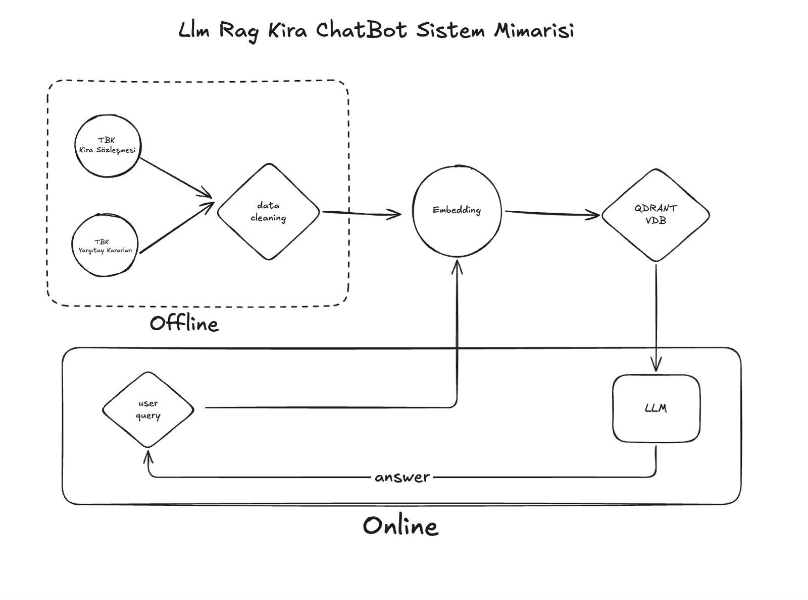

# Kira Hukuku AI Asistanı ⚖️

Bu proje; Türk Borçlar Kanunu ve Yargıtay emsal kararlarını analiz eden, **RAG (Retrieval-Augmented Generation)** mimarisiyle çalışan, yapay zeka destekli bir hukuk teknolojisi çözümüdür.

## 🏗️ Sistem Mimarisi

*Sistemin RAG pipeline'ı, vektör veritabanı sorgulama ve LLM yanıt üretim süreçlerini içermektedir.*

## 🛠️ Teknik Yığın (Tech Stack)
- **LLM:** Llama 3.3 (Groq API üzerinden)
- **Vektör Veritabanı:** Qdrant
- **Embedding:** E5 (multilingual-e5-base)
- **Arayüz:** Streamlit

## 🚀 Proje Demosu

## ⚙️ Kurulum
1. Repoyu klonlayın: `git clone https://github.com/yusufsakirr1/kira_hukuku_chatbot-llm_rag.git`
2. Gerekli kütüphaneleri yükleyin: `pip install -r requirements.txt`
3. `.streamlit/secrets.toml` dosyasını oluşturun ve API anahtarlarınızı ekleyin.
4. Uygulamayı çalıştırın: `streamlit run app.py`
